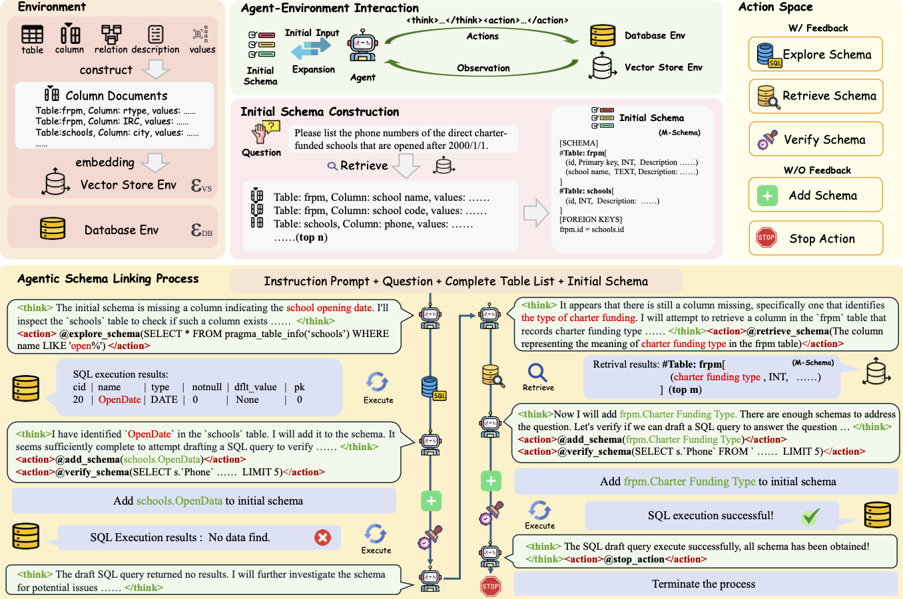

# AutoLink: Autonomous Schema Exploration and Expansion for Scalable Schema Linking in Text-to-SQL at Scale

| <a href="https://arxiv.org/abs/2511.17190"><b>arXiv</b></a> |

Our codes will be coming soon.

## Overview

For industrial-scale text-to-SQL, supplying the entire database schema to Large Language Models (LLMs) is impractical due to context window limits and irrelevant noise. Schema linking, which filters the schema to a relevant subset, is therefore critical. However, existing methods incur prohibitive costs, struggle to trade off recall and noise, and scale poorly to large databases. We present **AutoLink**, an autonomous agent framework that reformulates schema linking as an iterative, agent-driven process. Guided by an LLM, AutoLink dynamically explores and expands the linked schema subset, progressively identifying necessary schema components without inputting the full database schema. Our experiments demonstrate AutoLink's superior performance, achieving state-of-the-art strict schema linking recall of **97.4%** on Bird-Dev and **91.2%** on Spider-2.0-Lite, with competitive execution accuracy, i.e., **68.7** EX on Bird-Dev (better than CHESS) and **34.9** EX on Spider-2.0-Lite (ranking 2nd on the official leaderboard). Crucially, AutoLink exhibits **exceptional scalability**, **maintaining high recall**, **efficient token consumption**, and **robust execution accuracy** on large schemas (e.g., over 3,000 columns) where existing methods severely degrade—making it a highly scalable, high-recall schema linking solution for industrial text-to-SQL systems.
